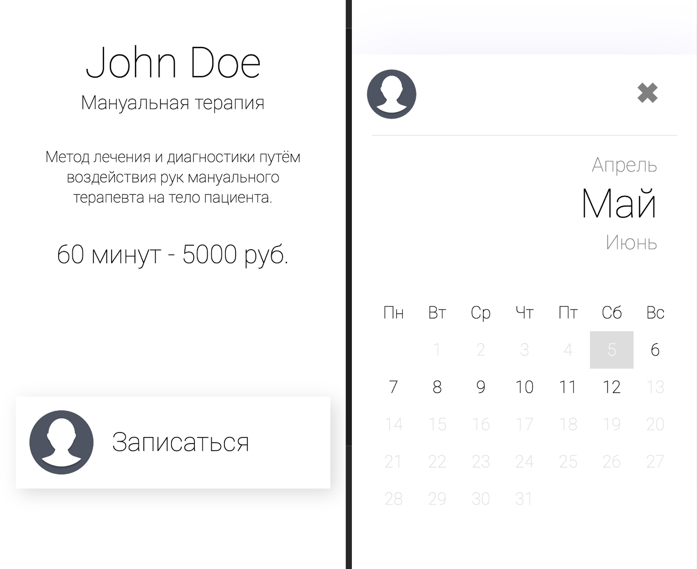
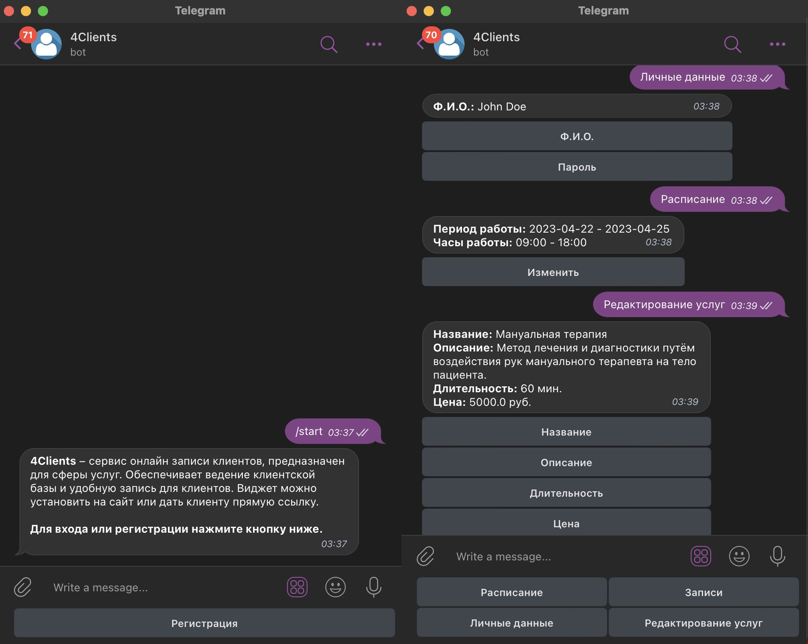

# Online Appointment scheduling microservices

## Based
#### Java + Spring Boot + Spring Security + JWT + RabbitMQ + MongoDB + H2 + Telegram API
<br>
<a href="https://github.com/set404/4Clients/tree/main/auth-service">Auth-Microservice</a><br>
<a href="https://github.com/set404/4Clients/tree/main/management-service">Management-Microservice</a><br>
<a href="https://github.com/set404/4Clients/tree/main/client-service">Client-Microservice</a><br>
<a href="https://github.com/kotomore/4Clients/tree/main/telegram-service">Telegram-Microservice</a><br>


## Swagger
http://45.159.249.5:8091/swagger-ui/index.html
<br>
<b>Select API definition (Management & Client)</b>

## Sample
### Clients side
https://taptimes.ru/6441a64b008d0c1864da7227
<br>



<br><br>

### Telegram bot
https://t.me/clientsmanagement_bot
<br>



## Install

```
git clone https://github.com/kotomore/TapTimes.git
```
>Rename and fill application.properties.origin files (in resource folder every microservice) to <b>application.properties</b> file
>Change root dir

```
mvn package -f pom.xml
docker-compose up
```