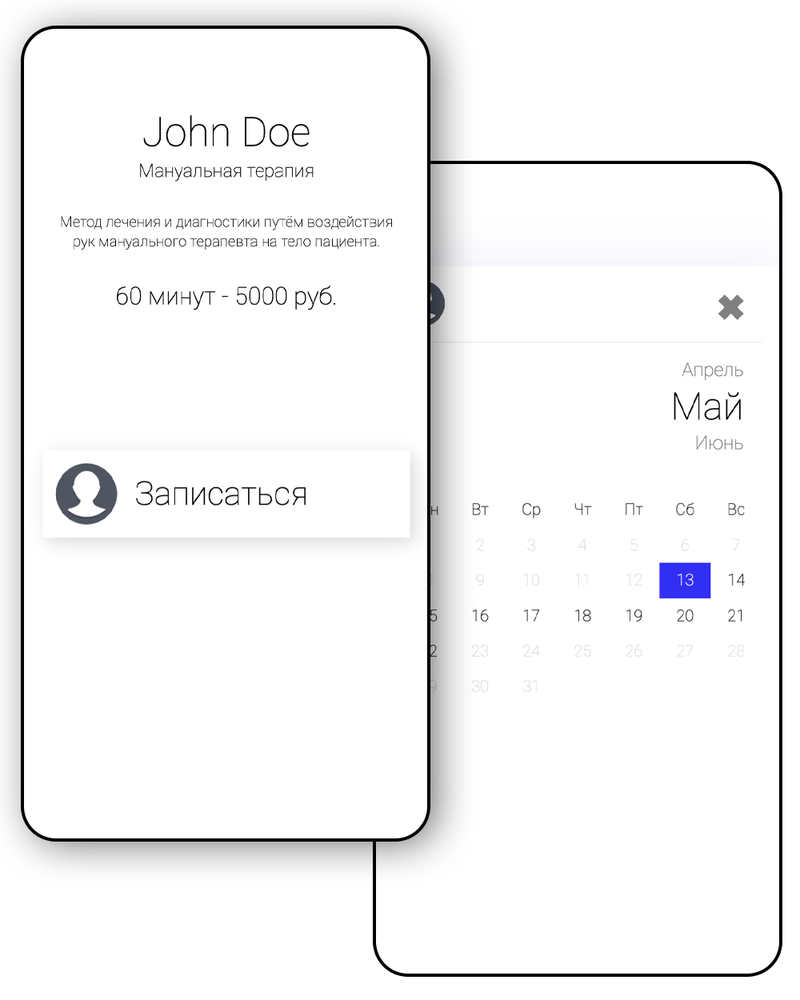
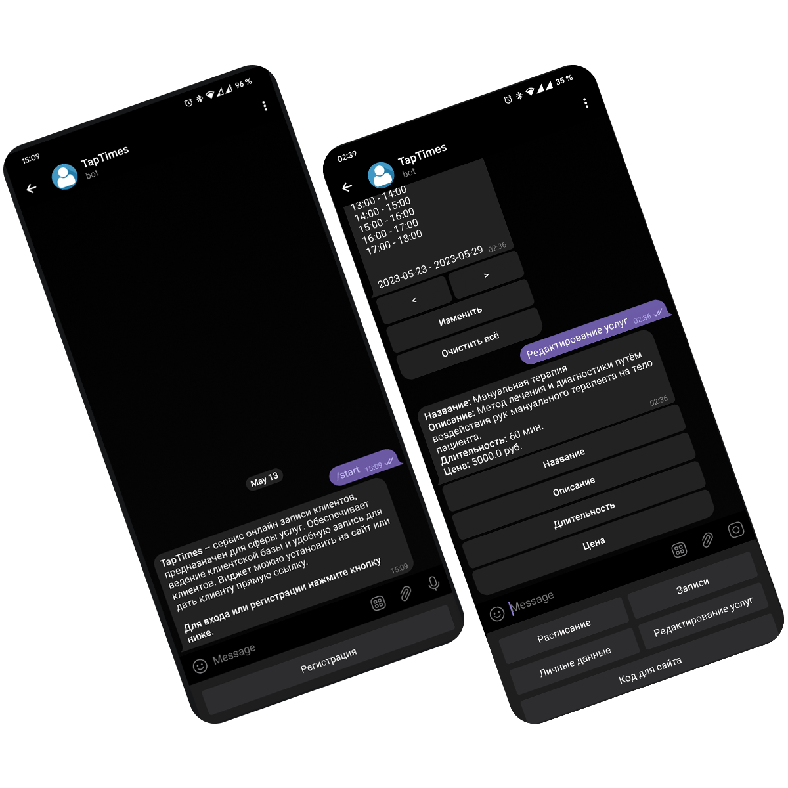

# Online Appointment service

## Based
#### Java + Multi-Module Maven + Spring Boot + Spring Security + JWT + RabbitMQ + MongoDB + H2 + Telegram API
<br>
<a href="https://github.com/kotomore/TapTimes/tree/main/auth-service">Authorization-Service</a><br>
<a href="https://github.com/kotomore/TapTimes/tree/main/management-service">Management-Service</a><br>
<a href="https://github.com/kotomore/TapTimes/tree/main/client-service">Client-Service</a><br>
<a href="https://github.com/kotomore/TapTimes/tree/main/telegram-service">Telegram-Service</a><br>


## Swagger
http://45.159.249.5:8091/swagger-ui/index.html
<br>
<b>Select API definition (Authorization, Management & Client)</b>

## Sample
### Clients side
https://taptimes.ru/6441a64b008d0c1864da7227
<br>



<br><br>

### Telegram bot
https://t.me/clientsmanagement_bot
<br>



## Install && launch

```
git clone https://github.com/kotomore/TapTimes.git
cd TapTimes
mvn package -f pom.xml
docker-compose up
```